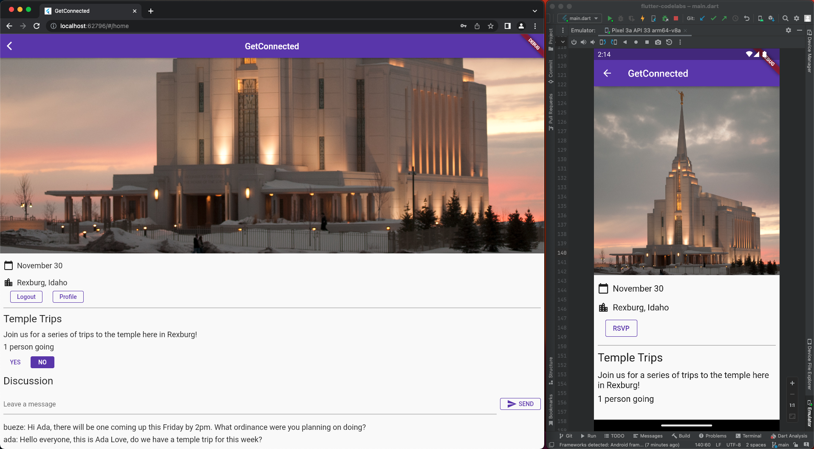
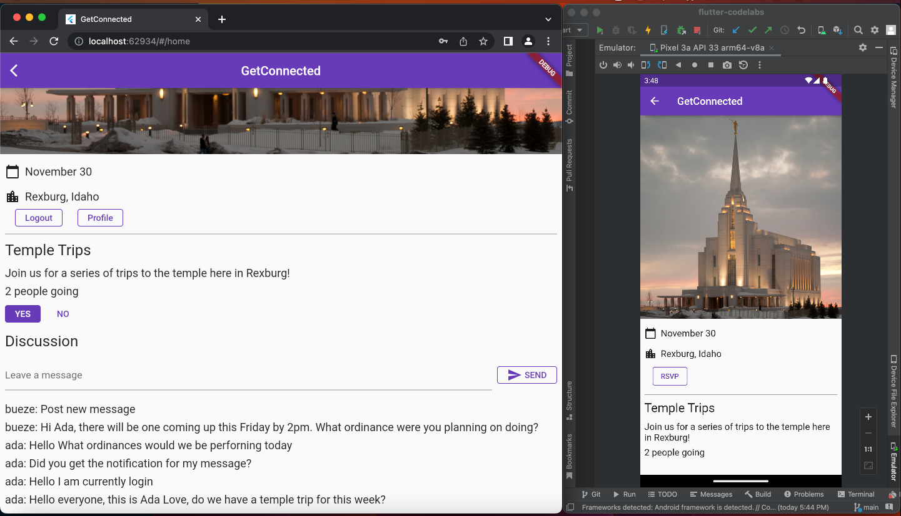
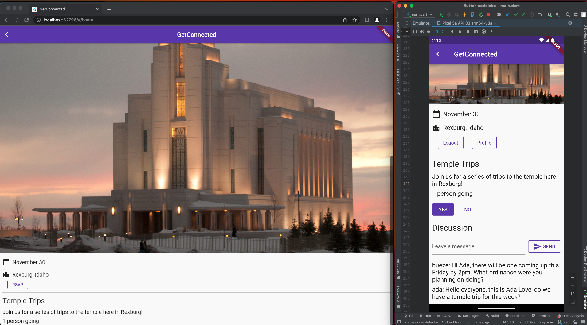
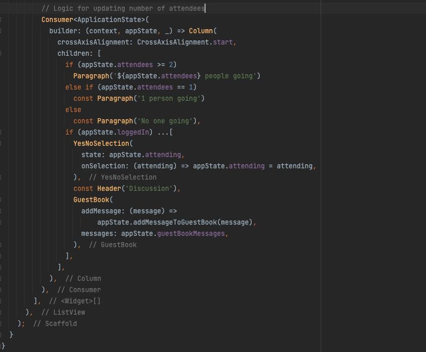
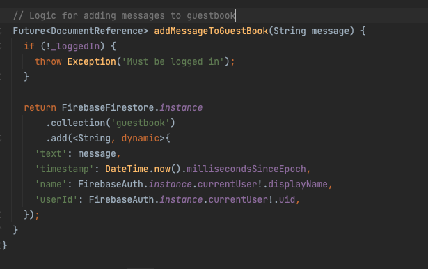
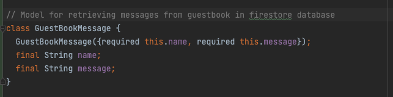
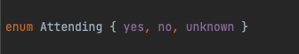

# RSVP Mobile Application
Mobile is everywhere, and the ability to make mobile applications has never been more sought after or desirable than it is now. Android applications are typically written in Java or Kotlin using Android Studio. iOS applications are written in Swift using XCode (using a Mac).

Other platforms have been created to make it easier to port to multiple platforms. React Native uses JavaScript to create apps that will run on both platforms. Flutter uses the Dart language to achieve the same result.

This project demonstrates how firebase connects seamlessly with flutter application.

You will see this in action with the aid of an RSVP business logic that helps people participate in exciting trips to the temple near them.

## YouTube Video
Here is a [link](https://youtu.be/gJefef-eabI) to watch a demonstration of this RSVP application in action.

## Tech Stack
- [Flutter](https://flutter.dev/)
- [Dart](https://dart.dev/get-dart)
- [Google Firebase Database](https://cloud.google.com/firestore/docs/client/get-firebase)
- Android Studio/VS Code

## Reference(s)
- [Get to know Firebase for flutter](https://firebase.google.com/codelabs/firebase-get-to-know-flutter#0)

## Picture Time
UIs

Some Code snippets

